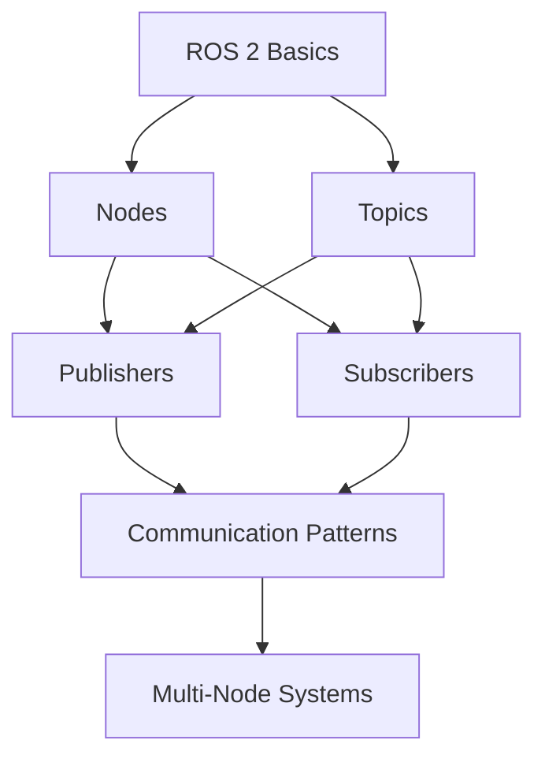

# Skill: Spec Cross-Reference Management

## Purpose
Maintain consistency and traceability across specifications, chapters, and learning outcomes through systematic cross-referencing.

## Responsibility
Create and maintain reference systems that connect related concepts, track dependencies, and ensure alignment across all book content.

## When to Use
- Linking related chapters and concepts
- Tracking prerequisite relationships
- Maintaining terminology consistency
- Connecting specs to implementations
- Ensuring learning outcome alignment

## Core Capabilities

### 1. Reference System Design
- Define reference conventions
- Establish linking patterns
- Create reference taxonomies
- Design bidirectional links
- Maintain reference integrity

### 2. Dependency Tracking
- Map conceptual dependencies
- Track prerequisite chains
- Identify circular dependencies
- Visualize dependency graphs
- Validate learning paths

### 3. Terminology Management
- Maintain glossary
- Ensure consistent usage
- Track term definitions
- Link to first usage
- Manage synonyms and aliases

### 4. Traceability
- Link specs to chapters
- Connect outcomes to assessments
- Trace requirements to implementations
- Map concepts to exercises
- Track coverage completeness

### 5. Consistency Validation
- Check broken links
- Verify terminology usage
- Validate prerequisite chains
- Ensure outcome alignment
- Detect inconsistencies

## Reference Conventions

### Chapter References
```markdown
<!-- Reference format -->
See [Chapter 3: ROS 2 Nodes](../chapter-03/index.md) for details.

<!-- Section reference -->
As explained in [Chapter 2, Section 2.3: Topics](../chapter-02/index.md#topics)...

<!-- Inline reference -->
Building on the publish-subscribe pattern ([Ch. 2](../chapter-02/index.md))...
```

### Concept References
```markdown
<!-- First definition (anchor) -->
## ROS 2 Topics {#ros2-topics}

A **topic** is a named channel for streaming data between nodes.

<!-- Later reference -->
Recall that [topics](#ros2-topics) enable decoupled communication...

<!-- Cross-chapter reference -->
Topics ([Ch. 3](../chapter-03/index.md#ros2-topics)) are the primary...
```

### Learning Outcome References
```markdown
<!-- In chapter spec -->
## Learning Outcomes
- **LO-3.1**: Explain the publish-subscribe pattern
- **LO-3.2**: Implement a ROS 2 publisher
- **LO-3.3**: Create a subscriber node

<!-- In assessment -->
This exercise assesses **LO-3.2** (Implement a ROS 2 publisher).

<!-- In capstone -->
The capstone project requires mastery of:
- LO-3.1, LO-3.2, LO-3.3 (Chapter 3)
- LO-4.1, LO-4.2 (Chapter 4)
```

### Code Example References
```markdown
<!-- Example definition -->
```python
# Example 3.1: Simple Publisher
import rclpy
from std_msgs.msg import String
# ... code ...
```

<!-- Reference to example -->
Modify Example 3.1 to publish at 10 Hz instead of 1 Hz.

<!-- Cross-reference -->
This pattern is similar to Example 2.3, but adds error handling.
```

## Dependency Mapping

### Prerequisite Chain
```markdown
# Chapter 5: Navigation

## Prerequisites
- **Chapter 3**: ROS 2 Nodes (required)
  - Understanding of node lifecycle
  - Ability to create and run nodes
- **Chapter 4**: Topics and Services (required)
  - Publish-subscribe pattern
  - Service request-response
- **Chapter 2**: ROS 2 Setup (assumed)
  - Working ROS 2 installation

## Builds Toward
- **Chapter 7**: Path Planning
- **Chapter 9**: Autonomous Systems
- **Capstone**: Autonomous Navigation Robot
```

### Concept Dependency Graph
```markdown
# Concept Dependencies



## Terminology Management

### Glossary Entry Format
```markdown
# Glossary

## Node
**Definition**: An independent process in a ROS 2 system that performs a specific task.

**First Introduced**: [Chapter 3: ROS 2 Nodes](../chapter-03/index.md#what-is-a-node)

**Related Terms**:
- [Publisher](#publisher)
- [Subscriber](#subscriber)
- [ROS 2 Graph](#ros2-graph)

**Usage Examples**:
- "Each node runs as a separate process"
- "Create a node using `rclpy.create_node()`"

**Common Misconceptions**:
- ❌ "Nodes must run on the same computer"
- ✅ "Nodes can run on different machines"

**See Also**:
- [Chapter 3, Section 3.2: Creating Nodes](../chapter-03/index.md#creating-nodes)
- [Example 3.1: Minimal Node](../chapter-03/examples.md#example-31)
```

### Terminology Consistency Check
```markdown
# Terminology Audit

## Term: "Topic" vs "Channel"
- **Preferred**: Topic
- **Avoid**: Channel (except in analogies)
- **Rationale**: "Topic" is the official ROS 2 terminology

## Term: "Message" vs "Data"
- **Context-dependent**:
  - Use "message" when referring to ROS 2 message types
  - Use "data" when referring to payload content
- **Example**: "The message contains sensor data"

## Consistency Rules
1. Always capitalize "ROS 2" (not "ros2" or "ROS2")
2. Use "node" not "Node" unless referring to the class
3. Use "publish-subscribe" not "pub-sub" in formal explanations
4. Use "pub-sub" acceptable in diagrams and informal contexts
```

## Traceability Matrix

### Spec to Implementation
```markdown
# Traceability: Chapter 3 Specification

| Spec Item | Chapter Section | Code Example | Exercise | Assessment |
|-----------|----------------|--------------|----------|------------|
| Explain nodes | 3.1 | Example 3.1 | Exercise 3.1 | Quiz 3.1 |
| Create publisher | 3.2 | Example 3.2 | Exercise 3.2 | Quiz 3.2 |
| Create subscriber | 3.3 | Example 3.3 | Exercise 3.3 | Quiz 3.3 |
| Understand QoS | 3.4 | Example 3.4 | Exercise 3.4 | Quiz 3.4 |

## Coverage Analysis
- ✅ All spec items have corresponding content
- ✅ All concepts have code examples
- ✅ All skills have practice exercises
- ✅ All outcomes have assessments
```

### Learning Outcome Coverage
```markdown
# Learning Outcome Coverage

## Chapter 3: ROS 2 Nodes

### LO-3.1: Explain the publish-subscribe pattern
**Taught in**:
- Section 3.1: Introduction to Topics
- Section 3.2: Publishers and Subscribers

**Practiced in**:
- Exercise 3.1: Identify pub-sub patterns
- Exercise 3.2: Design communication architecture

**Assessed in**:
- Quiz 3.1: Conceptual questions
- Capstone Phase 1: System design

**Status**: ✅ Fully covered

### LO-3.2: Implement a ROS 2 publisher
**Taught in**:
- Section 3.3: Creating Publishers
- Example 3.2: Simple Publisher

**Practiced in**:
- Exercise 3.3: Create custom publisher
- Exercise 3.4: Publish sensor data

**Assessed in**:
- Coding assignment 3.1
- Capstone Phase 2: Sensor integration

**Status**: ✅ Fully covered
```

## Reference Validation

### Automated Checks
```markdown
# Reference Validation Checklist

## Link Integrity
- [ ] All internal links resolve correctly
- [ ] No broken cross-references
- [ ] All chapter references valid
- [ ] All example references exist

## Terminology Consistency
- [ ] Glossary terms used consistently
- [ ] No undefined terms used
- [ ] Preferred terms used throughout
- [ ] Acronyms defined on first use

## Dependency Validity
- [ ] No circular prerequisites
- [ ] All prerequisites covered before use
- [ ] Learning path is logical
- [ ] Complexity increases appropriately

## Coverage Completeness
- [ ] All learning outcomes addressed
- [ ] All spec items implemented
- [ ] All concepts have examples
- [ ] All skills have exercises
```

### Manual Review Process
```markdown
# Cross-Reference Review Process

## Phase 1: Initial Review
1. Read chapter sequentially
2. Note all forward references
3. Verify backward references
4. Check prerequisite claims

## Phase 2: Terminology Audit
1. Extract all technical terms
2. Verify against glossary
3. Check consistency of usage
4. Update glossary as needed

## Phase 3: Dependency Validation
1. Map all prerequisites
2. Verify learning path
3. Check for gaps
4. Validate complexity progression

## Phase 4: Coverage Analysis
1. Map outcomes to content
2. Verify assessment alignment
3. Check example coverage
4. Validate exercise relevance
```

## Quality Standards

### Reference Accuracy
- All links resolve correctly
- References point to correct content
- Version-specific references noted
- Deprecated references removed

### Consistency
- Terminology used uniformly
- Reference format consistent
- Numbering schemes aligned
- Cross-references bidirectional

### Completeness
- All concepts properly linked
- Dependencies fully mapped
- Coverage gaps identified
- Traceability maintained

### Maintainability
- References easy to update
- Broken links detectable
- Consistency checkable
- Coverage measurable

## Integration Points
- Supports all specification skills
- Enables content authoring
- Facilitates assessment design
- Ensures learning path coherence
- Maintains book-wide consistency
